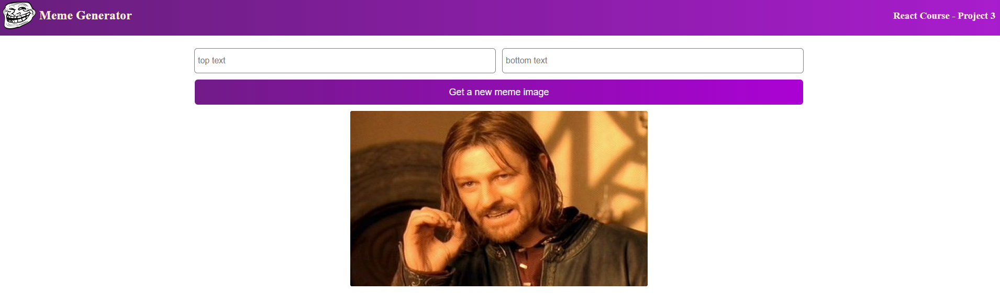
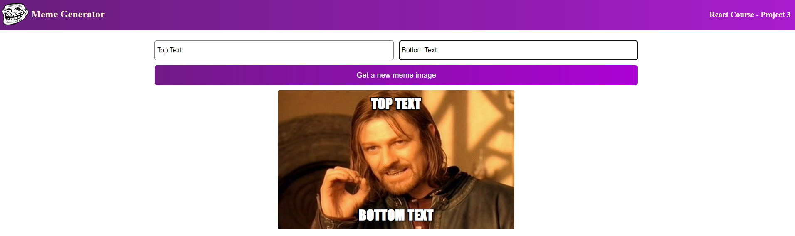

# Meme Generator

A simple meme generator. Two inputs which are top and bottom text include for users. Also have button for new random images from api.

## TABLE OF CONTENTS

- [Overview](#overview)
  - [Screenshot](#screenshot)
  - [Links](#links)
- [Process](#process)
  - [Overview](#process-overview)
- [Built With](#built-with)

## [Overview](#overview)

Users are allowed to:

- write two input boxes which are top and bottom text
- get random image from clicking button

## [Screenshot](#screenshot)

## [Links](#links)

## [Overview](#process-overview)

## [Built With](#built-with)

- Event Listeners
- Conditional Rendering
- State
- Forms
- Side Effects
