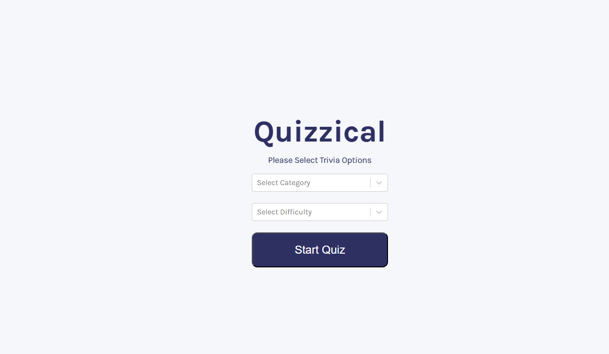
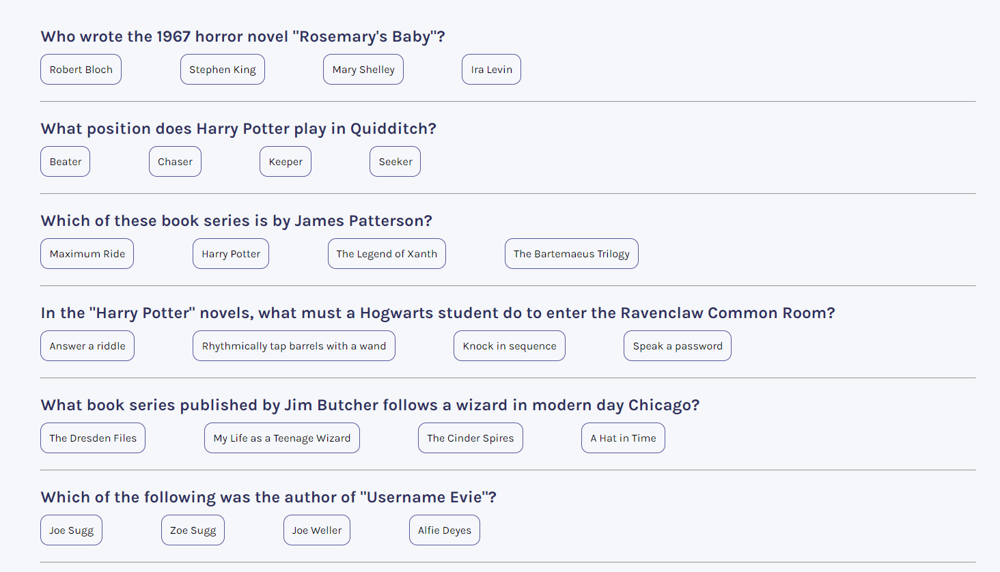
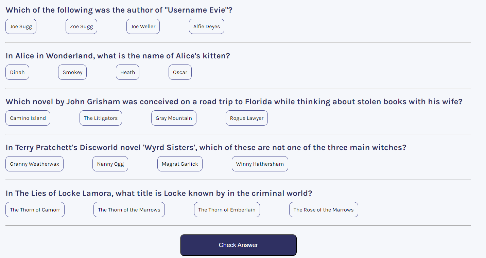
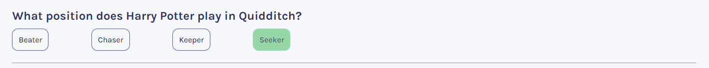
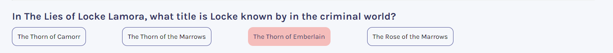

# Quizzical

A simple quiz app using OpenTriviaDB api. Two inputs which are questions category and diffuclty include for users. According to this selection open questions page after selection of answers user click check answer
and see its score.

## TABLE OF CONTENTS

- [Overview](#overview)
  - [Screenshot](#screenshot)
  - [Links](#links)
- [Process](#process)
  - [Overview](#process-overview)
- [Built With](#built-with)

## [Overview](#overview)

Users are allowed to:

- select two input question category and question difficulty
- see score
- play again

## [Screenshot](#screenshot)

- Quiz Settings Screen
  

- Question Screen - 1
  

- Question Screen - 2
  

- Correnct Question Screen
  

- Incorrect Question Screen
  

- Score and Play Again Button Screen
  

## [Links](#links)

This is is my api link :
https://opentdb.com/api_config.php

## [Overview](#process-overview)

## [Built With](#built-with)

- Event Listeners
- Conditional Rendering
- State
- Side Effects
